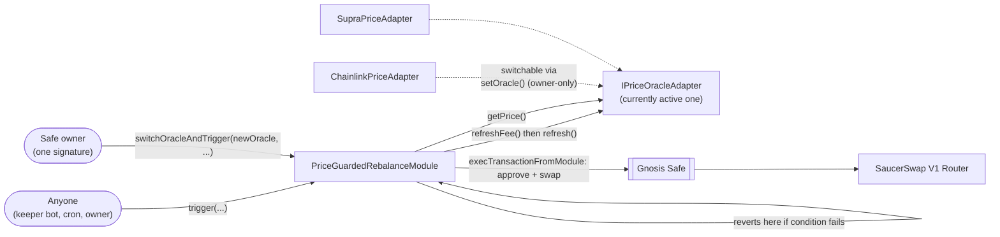

# hedera-safe-swap

A Gnosis Safe multisig treasury on Hedera, with two Safe modules that rebalance idle treasury
holdings through [SaucerSwap](https://www.saucerswap.finance/):

- **`RebalanceModule`** — an owner triggers a swap directly, any time.
- **`PriceGuardedRebalanceModule`** — permissionless to call, but only executes when a live price
  condition holds. Anyone (a keeper bot, a cron job) can call `trigger()`; the price is the guard,
  not the caller. The oracle backing it isn't fixed: it reads through a common
  `IPriceOracleAdapter` interface, with real adapters for **Chainlink** and **Supra**. The Safe
  owner can switch which one is active — and fire a trigger — in a single signed transaction via
  `switchOracleAndTrigger()`, without redeploying or losing the configured trigger condition. See
  [Verified testnet transaction](#verified-testnet-transaction) for a real combined switch+trigger
  on testnet.

Removing either integration removes the point of the module it's in: `RebalanceModule` without
SaucerSwap is a stock Safe deployment, and `PriceGuardedRebalanceModule` without a real oracle
adapter has no condition to gate on — it'd just be `RebalanceModule` again, badly.

## What's here

- `packages/contracts/contracts/RebalanceModule.sol` — owner-triggered swap through SaucerSwap.
- `packages/contracts/contracts/PriceGuardedRebalanceModule.sol` — permissionless swap, gated on
  whichever `IPriceOracleAdapter` is currently set. Both are meant to be extended (see
  [AGENTS.md](AGENTS.md)).
- `packages/contracts/contracts/oracle/` — `IPriceOracleAdapter.sol` (the common interface) plus
  `ChainlinkPriceAdapter.sol` and `SupraPriceAdapter.sol` — thin wrappers translating each
  oracle's real wire format into the same `(price, expo, publishTime)` shape.
- `packages/contracts/contracts/vendor/` — pulls the unmodified `@safe-global/safe-contracts`
  Safe singleton and `SafeProxyFactory` into the compile graph.
- `packages/contracts/contracts/mocks/` — test doubles (`MockSafe`, `MockERC20`,
  `MockSaucerSwapRouter`, `MockOracleAdapter`, `MockChainlinkAggregator`, `MockSupraStorage`) used
  only by the test suite, not deployed.
- `packages/contracts/scripts/deploy.ts` — the real deploy sequence for `RebalanceModule` (Phase 4).
- `packages/contracts/scripts/deploy-oracle-adapters.ts` — deploys both oracle adapters and the
  `PriceGuardedRebalanceModule`, enables it, fires a plain `trigger()` via Chainlink, then a
  combined `switchOracleAndTrigger()` to Supra in one signed call — see the proof below.
- `packages/contracts/scripts/demo-rebalance.ts` — seeds the deployed Safe and triggers a real
  swap through `RebalanceModule` (Phase 7 — produced the transaction below).
- `packages/frontend` — Next.js app: wallet connect, a read-only Safe/treasury ledger, a
  rebalance-trigger flow, and a price-guard section (`lib/usePriceGuard.ts` is the hook behind
  it), all reading the real deployed contracts.

## Prerequisites

- Node 20.18.3+
- A funded Hedera testnet account (testnet HBAR from the [Hedera Portal faucet](https://portal.hedera.com/))
- A wallet extension that supports Hedera testnet (HashPack or Blade)

## Setup

```bash
npm install
cp .env.example .env
```

Then fill in `.env`:

| Variable                    | Where it comes from                                                                                                                                                                                                                 |
| --------------------------- | ----------------------------------------------------------------------------------------------------------------------------------------------------------------------------------------------------------------------------------- |
| `HEDERA_OPERATOR_ID`        | Your account ID (`0.0.x`) from the [Hedera Portal](https://portal.hedera.com/)                                                                                                                                                      |
| `HEDERA_OPERATOR_KEY`       | That account's **ECDSA** private key — not ED25519, which has no EVM alias. Fund the account with the Portal's testnet faucet before deploying.                                                                                     |
| `HEDERA_TESTNET_RPC_URL`    | Defaults to `https://testnet.hashio.io/api`, Hedera's public JSON-RPC relay                                                                                                                                                         |
| `SAUCERSWAP_ROUTER_ADDRESS` | The V1 router's EVM address. On testnet: `0x0000000000000000000000000000000000004b40` (contract `0.0.19264` — resolve the EVM form of any Hedera contract ID via `GET https://testnet.mirrornode.hedera.com/api/v1/contracts/{id}`) |
| `NEXT_PUBLIC_SAUCERSWAP_ROUTER_ADDRESS` | Same address as above, exposed to the browser — the frontend uses it for live swap quotes via `getAmountsOut` |
| `NEXT_PUBLIC_SAFE_ADDRESS`  | Printed by `deploy.ts` below — leave blank until you've deployed                                                                                                                                                                    |
| `NEXT_PUBLIC_MODULE_ADDRESS` | Also printed by `deploy.ts` — the `RebalanceModule` address |
| `NEXT_PUBLIC_PRICE_GUARD_MODULE_ADDRESS` | Printed by `deploy-oracle-adapters.ts` — optional, the Price Guard UI section hides itself if unset |
| `NEXT_PUBLIC_CHAINLINK_ADAPTER_ADDRESS` / `NEXT_PUBLIC_SUPRA_ADAPTER_ADDRESS` | Also printed by `deploy-oracle-adapters.ts` — only the ones set show up as switch options in the UI |

## Deploy contracts to Hedera testnet

```bash
npm run build --workspace packages/contracts
npx hardhat run packages/contracts/scripts/deploy.ts --network hedera-testnet
```

This deploys the Safe singleton, `SafeProxyFactory`, one Safe proxy, and `RebalanceModule`, then
enables the module on the Safe. Copy the printed Safe address into `NEXT_PUBLIC_SAFE_ADDRESS`.

By default the Safe is deployed 1-of-1, owned by the deployer — enough to demo the module without
external wallet signing. For a real multi-owner Safe, set `SAFE_OWNERS` (comma-separated
addresses) and `SAFE_THRESHOLD` before deploying; `enableModule` then won't run automatically
(it needs a threshold of owner signatures collected out of band — see the script's console output
for what to submit).

## Run the frontend

```bash
npm run dev
```

Open http://localhost:3000. Connect any EIP-1193 wallet (MetaMask, HashPack, or Blade in EVM
mode — Hedera testnet is a standard EVM chain, so no HashConnect SDK is needed) and it prompts to
add/switch to Hedera testnet automatically. Once connected, the page reads the Safe's owners,
threshold, module status, and live treasury balances, and gives you two ways to move funds:

- **Rebalance** — owner-triggered, either direction (a toggle flips `tokenIn`/`tokenOut`), with a
  live SaucerSwap quote and a slippage % control that computes a real `amountOutMin`.
- **Price Guard** — shows `PriceGuardedRebalanceModule`'s configured trigger condition (labeled
  `Condition (HBAR/USD)` — it's explicitly not a SAUCE price condition; WHBAR is Hedera's native
  token 1:1 wrapped, so its dollar value tracks HBAR/USD directly, which is what actually gates
  the swap even though the swap itself moves WHBAR/SAUCE), a direction toggle just like Rebalance,
  and Safe owners get a **Trigger with** picker (Chainlink, Supra, whichever adapters are
  configured) right next to the amount field. Picking a different oracle previews its live price
  and whether the condition would hold for it *before* you commit to anything. If the picked
  oracle isn't already active, one click both switches to it and fires the trigger in a single
  signed transaction (`switchOracleAndTrigger`) — no separate "switch" step. The button stays
  disabled until the selected oracle's condition actually holds.

Both share a step tracker (submitted → pending → mirror node → confirmed) and a direct Hashscan
link on success. The Price Guard section only renders if `NEXT_PUBLIC_PRICE_GUARD_MODULE_ADDRESS`
is set — it's optional.

## Architecture

**Components.** The Safe holds the treasury and is the only account SaucerSwap ever sees funds
move through. `RebalanceModule` is enabled on the Safe but never holds tokens itself — it only
has permission to make the Safe act.


**Why the module can't just hold funds itself:** the whole point is the Safe's multisig custody
stays intact — the module only ever acts _through_ `execTransactionFromModule`, so token balances
never leave Safe custody even mid-swap. Removing SaucerSwap from this picture removes the reason
the module exists; a Safe with no module is just a stock deployment, which is the gap this
template fills.

**Trigger flow in one call.** `rebalance()` does two things transactionally: it makes the Safe
`approve` the router for `amountIn`, then makes the Safe call `swapExactTokensForTokens`. Both
calls happen from `msg.sender == Safe`'s perspective, since `execTransactionFromModule` executes
_as_ the Safe, not as the module.

**The price-guarded path** is the same Safe-custody mechanism, with an oracle-agnostic guard in
front of it:



`trigger()` is intentionally permissionless — the safety property isn't "only an owner can call
this," it's "this only ever executes when the price condition the owner configured actually
holds." Choosing the oracle is a different story: only the Safe owner can do that, via `setOracle()`
or the combined `switchOracleAndTrigger()`, because letting an arbitrary caller pick which oracle
backs the check would let them point it at a contract that always says the condition is met —
defeating the guard entirely. `trigger()` never takes an oracle argument for exactly this reason.

**Why a common adapter interface, not two separate modules.** `PriceGuardedRebalanceModule` never
needs to know which real oracle it's talking to: `refreshFee()` tells it exactly how much of
`msg.value` to forward before calling `refresh()` (both are no-ops for Chainlink/Supra, since
they're push-model and already fresh — the split exists so a future pull-model adapter, like a
reintroduced Pyth, could slot in without changing the module), and `getPrice()` always returns the
same three fields regardless of the oracle's native decimals or timestamp units — Supra's `time`
is Unix *milliseconds* and its `price` is *unsigned*, both silently wrong if forwarded as-is; each
adapter normalizes this itself, not the module.

## Verified testnet transaction

Safe deployment (Phase 4) — module enabled on the Safe:

- Safe: [`0x487f330a30E6c7101f86e598BE27a5d46C8B3589`](https://hashscan.io/testnet/contract/0x487f330a30E6c7101f86e598BE27a5d46C8B3589)
- RebalanceModule: [`0x27714cc6907e8EB771CCe77159111b19Aa2E9Efe`](https://hashscan.io/testnet/contract/0x27714cc6907e8EB771CCe77159111b19Aa2E9Efe)
- `enableModule` tx: [`0x7054822d2f421fc441d9bfeec9d7bd4bda2c5aeb5a3e337bc200ad4bf8c45678`](https://hashscan.io/testnet/transaction/0x7054822d2f421fc441d9bfeec9d7bd4bda2c5aeb5a3e337bc200ad4bf8c45678)
- Mirror node: `GET https://testnet.mirrornode.hedera.com/api/v1/contracts/results/0x7054822d2f421fc441d9bfeec9d7bd4bda2c5aeb5a3e337bc200ad4bf8c45678` → `status: 0x1` (SUCCESS)

Rebalance (Phase 7) — a real swap executed through the module against SaucerSwap's live V1
router, converting the Safe's WHBAR into SAUCE:

- Rebalance tx: [`0x432d5e6bf726905b5e108d84f6e06df836473b8f80f3d061b777c93f039f322e`](https://hashscan.io/testnet/transaction/0x432d5e6bf726905b5e108d84f6e06df836473b8f80f3d061b777c93f039f322e)
- Mirror node: `GET https://testnet.mirrornode.hedera.com/api/v1/contracts/results/0x432d5e6bf726905b5e108d84f6e06df836473b8f80f3d061b777c93f039f322e` → `status: 0x1` (SUCCESS)
- Result: Safe swapped 2.5 WHBAR for 1.37386050 SAUCE via the SaucerSwap V1 HBAR-SAUCE pool
- Reproduce with `packages/contracts/scripts/demo-rebalance.ts` — see script header for what it does (HTS association, WHBAR wrap, funding the Safe, then triggering the module)

**`PriceGuardedRebalanceModule` with switchable oracles** — deployed at
[`0x1076c12c4b870AA2aBCb1Eda468FC3e2dECe258D`](https://hashscan.io/testnet/contract/0x1076c12c4b870AA2aBCb1Eda468FC3e2dECe258D),
enabled on the Safe, and put through both trigger paths against two live, independently verified
oracle providers:

| Call | Adapter | Trigger tx | Observed price |
|---|---|---|---|
| `trigger()` (plain) | [`ChainlinkPriceAdapter`](https://hashscan.io/testnet/contract/0xB6867f3Fc37bbEB92C8ff717A3DBEAaeb914D25f) — wraps [`0x59bC155EB6c6C415fE43255aF66EcF0523c92B4a`](https://hashscan.io/testnet/contract/0x59bC155EB6c6C415fE43255aF66EcF0523c92B4a) (Chainlink's real HBAR/USD feed) | [`0xcefc70ea...431dc7`](https://hashscan.io/testnet/transaction/0xcefc70ea6de15ab40b6c7b0a791e4babb02e42597c1f230bc721a48827431dc7) | **$0.09403916** (8 decimals) |
| `switchOracleAndTrigger()` (combined) | [`SupraPriceAdapter`](https://hashscan.io/testnet/contract/0x6E4933E4f2582865A4BDa4250a1A0E5e0b790Eb1) — wraps [`0x6Cd59830AAD978446e6cc7f6cc173aF7656Fb917`](https://hashscan.io/testnet/contract/0x6Cd59830AAD978446e6cc7f6cc173aF7656Fb917) (Supra's real push-oracle storage) | [`0xc1757e94...5d5f90`](https://hashscan.io/testnet/transaction/0xc1757e9430e87d4599a2fed9ef3bde570040558c3127a091b1a308fab35d5f90) | **$0.09388700** (18 decimals) |

Both transactions: `status: 0x1` (SUCCESS), independently confirmed via mirror node. The second one
was decoded to confirm **both `OracleChanged` and `Rebalanced` fired in the same transaction** —
proof the combined call genuinely switches and swaps atomically, not two calls disguised as one.
Trigger condition for both: HBAR/USD ≤ $0.10. **The two prices are genuinely different** (two
independent providers, read moments apart) and use **different native decimal conventions** (8 vs.
18) — both correctly normalized against the same trigger by
`PriceGuardedRebalanceModule.normalize()`, and both triggered a real swap with **zero fee and zero
update data required**, since Chainlink and Supra are push-model and already fresh
(`refreshFee()` returns `0` for both). Reproduce with `packages/contracts/scripts/deploy-oracle-adapters.ts`.

**A real lesson from getting this proof, not a hypothetical:** the first attempt at the Chainlink
trigger reverted with `StalePrice`. Supra's testnet feed updates roughly every 20-30 seconds, but
Chainlink's testnet heartbeat is far coarser — its last update was ~80 minutes old at the time,
past the 1-hour `maxPriceAgeSeconds` the module was configured with. "Push-model" doesn't mean
"continuously fresh" on every network — it means *some* network keeps it updated on its own
schedule, and that schedule varies a lot between providers and between testnet and mainnet.
`maxPriceAgeSeconds` is now `86400` (24h) to comfortably cover both without weakening the guard in
any way that matters (mainnet feeds update far more reliably than testnet ones).

**Pyth was removed.** An earlier version of this module also had a `PythPriceAdapter`. It worked,
but Pyth's Hermes API (the off-chain service needed to push fresh price data) started requiring an
API key partway through building this, and even without one the adapter could only read Pyth's
testnet contract's last-pushed price — sometimes weeks stale. Chainlink and Supra don't have this
limitation: both are push-model with no off-chain step required at all, which is a strictly better
fit for a module whose whole point is a permissionless, no-friction trigger. The
`IPriceOracleAdapter` interface still supports pull-model oracles if one is ever worth adding back.

## Off-chain limit orders were considered and ruled out

SaucerSwap V3 has a native order-book/limit-order product that would, in principle, let the Safe
post a price-bounded order off-chain and have it filled on-chain later without paying for a
trigger transaction up front. That only works for a Safe (a smart-contract wallet with no private
key of its own to sign with) if the order-filling contract supports **EIP-1271**
(`isValidSignature`) so it can verify the Safe's `approvedHash`-style authorization instead of a
raw ECDSA signature. We checked directly rather than assuming: pulled the real reactor contract's
deployed bytecode (`0x5707B946EE64bD750A587261Ce36ec7024F3088B`) and searched all ~48KB of it for
the EIP-1271 magic value (`0x1626ba7e`) and both `isValidSignature` selector forms
(`bytes32,bytes` and `bytes,bytes`) — none appear anywhere in the bytecode. SaucerSwap V3's
limit-order reactor does not support smart-contract-wallet signatures on Hedera testnet today, so
a Safe cannot use it. We did not build an off-chain option on top of a mechanism that can't
actually authorize the Safe; the on-chain `trigger()`/`switchOracleAndTrigger()` path above is the
real answer instead.

## Reproducing the transaction

```bash
SAFE_ADDRESS=<from NEXT_PUBLIC_SAFE_ADDRESS> \
MODULE_ADDRESS=<RebalanceModule address, printed by deploy.ts> \
npx hardhat run packages/contracts/scripts/demo-rebalance.ts --network hedera-testnet
```

This script is what produced the transaction above. It, in order:

1. Associates the deployer's account with WHBAR and SAUCE (Hedera requires explicit HTS
   association before an account can hold a token — via each token's `IHRC719.associate()`).
2. Wraps 5 testnet HBAR into WHBAR through SaucerSwap's `WhbarHelper`.
3. Associates the **Safe** with both tokens too, via an owner-authorized `execTransaction` (the
   Safe is a separate account from the deployer, so it needs its own association).
4. Transfers half the wrapped WHBAR into the Safe.
5. Calls `RebalanceModule.rebalance()` as the Safe's owner, swapping that WHBAR for SAUCE through
   the real SaucerSwap V1 router — the transaction linked above.

The token pair, wrap amount, and split are constants near the top of the script — edit them
directly if you want to reproduce this against a different SaucerSwap pool.

## Reproducing the oracle switch

```bash
SAFE_ADDRESS=<from NEXT_PUBLIC_SAFE_ADDRESS> \
SAUCERSWAP_ROUTER_ADDRESS=<from .env> \
npx hardhat run packages/contracts/scripts/deploy-oracle-adapters.ts --network hedera-testnet
```

This is what produced the Chainlink/Supra proof above. It, in order:

1. Deploys `ChainlinkPriceAdapter` and `SupraPriceAdapter`, each pointed at the real oracle
   contract on Hedera testnet.
2. Deploys a fresh `PriceGuardedRebalanceModule` starting on the Chainlink adapter, and enables it
   on the Safe.
3. Fires a plain `trigger()` — Chainlink's live price against a $0.10 HBAR/USD ≤ condition.
4. Calls `switchOracleAndTrigger()` — switches to the Supra adapter *and* fires a second trigger,
   both in one signed transaction.

Requires the Safe to already hold some WHBAR (see `demo-rebalance.ts` above to fund it). Copy the
printed addresses into `.env` as `NEXT_PUBLIC_PRICE_GUARD_MODULE_ADDRESS`,
`NEXT_PUBLIC_CHAINLINK_ADAPTER_ADDRESS`, and `NEXT_PUBLIC_SUPRA_ADAPTER_ADDRESS` to see the new
module and its switch options in the frontend.

## License

MIT
