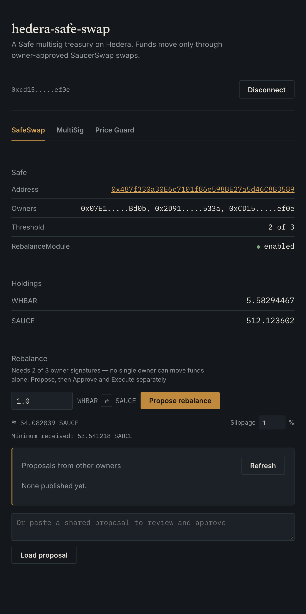
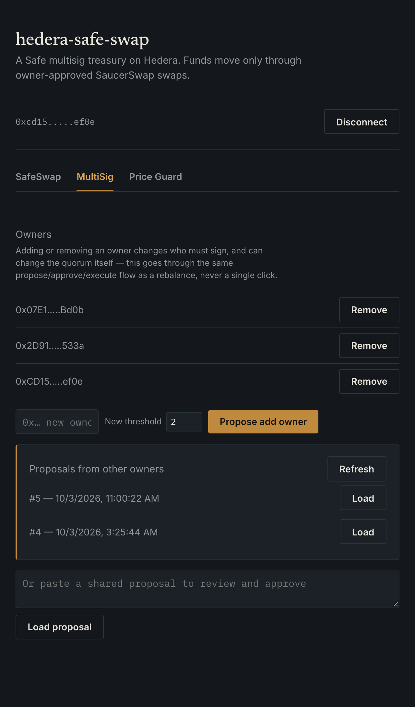
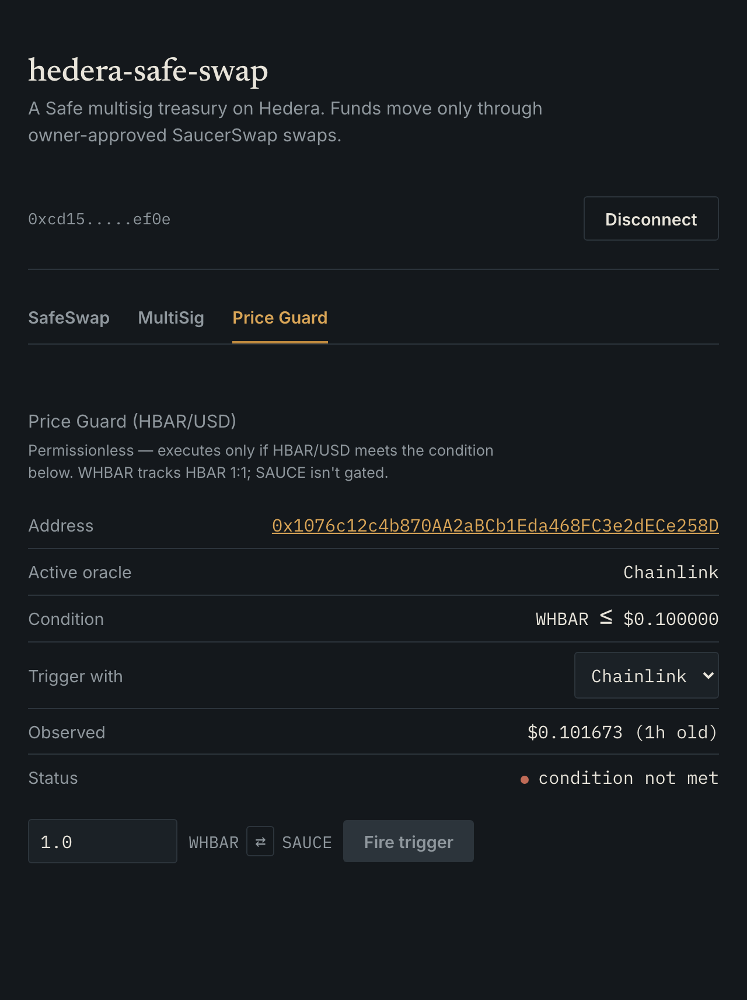
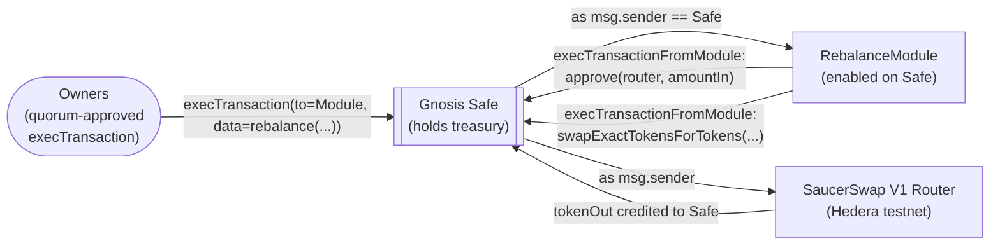

# hedera-safe-swap

A Gnosis Safe multisig treasury template for Hedera. A 2-of-3 owner quorum rebalances idle
holdings through [SaucerSwap](https://www.saucerswap.finance/), a permissionless module swaps
automatically when a live Chainlink or Supra price condition holds, and pending proposals are
relayed between owners over Hedera's native Consensus Service (HCS) instead of a backend. Every
claim below is backed by a real Hedera testnet transaction, independently re-confirmed via the
mirror node — see [Verified testnet transaction](#verified-testnet-transaction).

| SafeSwap | MultiSig | Price Guard |
| :---: | :---: | :---: |
|  |  |  |

_Live testnet state, viewed as one of the Safe's three owners. Each tab is described under
[Run the frontend](#run-the-frontend)._

**Contents:** [What's here](#whats-here) ·
[Setup](#setup) · [Deploy](#deploy-contracts-to-hedera-testnet) · [Fund the Safe](#fund-the-safe) ·
[Run the frontend](#run-the-frontend) · [Architecture](#architecture) ·
[Verified testnet transaction](#verified-testnet-transaction) ·
[Multisig](#multisig-adding-owners-and-quorum-gated-rebalances) ·
[Proposal relay via HCS](#proposal-relay-via-hcs) ·
[Off-chain limit orders](#off-chain-limit-orders-were-considered-and-ruled-out) ·
[Reproducing the transaction](#reproducing-the-transaction) ·
[Reproducing the oracle switch](#reproducing-the-oracle-switch) ·
[Reproducing the multisig proof](#reproducing-the-multisig-proof) ·
[Reproducing the HCS topic](#reproducing-the-hcs-topic) ·
[Reproducing the majority guard](#reproducing-the-majority-guard)

Two Safe modules do the actual work:

- **`RebalanceModule`** — the Safe's configured signature threshold triggers a swap, any time.
  `rebalance()` only accepts calls from the Safe itself (`msg.sender == address(safe)`) — never a
  single owner acting alone — so a 2-of-3 Safe genuinely needs 2 owners' approval to move funds
  this way. See [Multisig: adding owners and quorum-gated
  rebalances](#multisig-adding-owners-and-quorum-gated-rebalances) for how that works without a
  backend to relay signatures.
- **`PriceGuardedRebalanceModule`** — permissionless to call, but only executes when a live price
  condition holds. Anyone (a keeper bot, a cron job) can call `trigger()`; the price is the guard,
  not the caller. The oracle backing it isn't fixed: it reads through a common
  `IPriceOracleAdapter` interface, with real adapters for **Chainlink** and **Supra**. The Safe
  owner can switch which one is active — and fire a trigger — in a single signed transaction via
  `switchOracleAndTrigger()`, without redeploying or losing the configured trigger condition. See
  [Verified testnet transaction](#verified-testnet-transaction) for a real combined switch+trigger
  on testnet.

Alongside them, **`MajorityThresholdGuard`** (a Safe transaction guard) keeps a strict majority of
owners in charge on-chain — any transaction that would leave, say, 1 of 4 reverts.

Removing either integration removes the point of the module it's in: `RebalanceModule` without
SaucerSwap is a stock Safe deployment, and `PriceGuardedRebalanceModule` without a real oracle
adapter has no condition to gate on — it'd just be `RebalanceModule` again, badly.

## What's here

- `packages/contracts/contracts/RebalanceModule.sol` — swap through SaucerSwap, callable only by the
  Safe itself, so it always needs the Safe's full owner quorum.
- `packages/contracts/contracts/PriceGuardedRebalanceModule.sol` — permissionless swap, gated on
  whichever `IPriceOracleAdapter` is currently set. Both are meant to be extended (see
  [AGENTS.md](AGENTS.md)).
- `packages/contracts/contracts/MajorityThresholdGuard.sol` — a Safe transaction guard that reverts any
  `execTransaction` leaving the threshold below a strict majority of owners — so 1 of 4 is
  impossible on-chain, not just refused by the app.
- `packages/contracts/contracts/oracle/` — `IPriceOracleAdapter.sol` (the common interface) plus
  `ChainlinkPriceAdapter.sol` and `SupraPriceAdapter.sol` — thin wrappers translating each
  oracle's real wire format into the same `(price, expo, publishTime)` shape.
- `packages/contracts/contracts/vendor/` — pulls the unmodified `@safe-global/safe-contracts`
  Safe singleton and `SafeProxyFactory` into the compile graph.
- `packages/contracts/contracts/mocks/` — test doubles (`MockSafe`, `MockERC20`,
  `MockSaucerSwapRouter`, `MockOracleAdapter`, `MockChainlinkAggregator`, `MockSupraStorage`) used
  only by the test suite, not deployed.
- `packages/contracts/scripts/deploy.ts` — the real deploy sequence: Safe, `SafeProxyFactory`, `RebalanceModule`, enable module.
- `packages/contracts/scripts/deploy-oracle-adapters.ts` — deploys both oracle adapters and the
  `PriceGuardedRebalanceModule`, enables it, fires a plain `trigger()` via Chainlink, then a
  combined `switchOracleAndTrigger()` to Supra in one signed call — see the proof below.
- `packages/contracts/scripts/demo-rebalance.ts` — seeds the deployed Safe and triggers a real
  swap through `RebalanceModule` (produced the transaction below).
- `packages/contracts/scripts/deploy-multisig-rebalance.ts` — deploys a fresh `RebalanceModule`,
  grows the Safe from 1 to 3 owners, raises the threshold to 2-of-3, and proves a real
  quorum-gated rebalance (including a deliberate premature-execution attempt that must revert) —
  see [Multisig](#multisig-adding-owners-and-quorum-gated-rebalances) below.
- `packages/contracts/scripts/create-proposals-topic.ts` — creates the HCS topic Safe proposals
  (rebalances and owner changes) get published to — see [Proposal relay via
  HCS](#proposal-relay-via-hcs) below.
- `packages/frontend` — Next.js app, organized into three tabs (**SafeSwap**, **MultiSig**, **Price
  Guard**): a read-only Safe/treasury ledger and quorum-gated rebalance flow, an owner
  add/remove flow that goes through the identical quorum machinery, and a price-guard section.
  Both quorum flows (`lib/multisig.ts` + `lib/useMultisigRebalance.ts`) share one generalized
  propose/approve/execute system — a `SafeProposal` tagged by `kind` (`"rebalance"`, `"addOwner"`,
  or `"removeOwner"`) — with proposals relayed via HCS (`lib/hcs.ts` +
  `app/api/proposals/route.ts`). The price-guard tab is built on `lib/usePriceGuard.ts`. Everything
  reads the real deployed contracts.

## Prerequisites

- Node 20.18.3+
- A funded Hedera testnet account (testnet HBAR from the [Hedera Portal faucet](https://portal.hedera.com/))
- Any EIP-1193 wallet extension (MetaMask, HashPack, or Blade in EVM mode) — Hedera testnet is a
  standard EVM chain, so no Hedera-specific wallet SDK is required

## Setup

Scaffold a copy of this template:

```bash
npm create scaffold-hbar@latest hedera-safe-swap -- --template ETIM-PAUL/Hedara-Safe
cd hedera-safe-swap
```

Keep the bare `--`: without it, npm keeps `--template` for itself and passes `ETIM-PAUL/Hedara-Safe`
on as the project name, which fails with "name can no longer contain capital letters". The
scaffold installs dependencies for you. If you cloned the repo instead, run `npm install` first.
Then:

```bash
cp .env.example .env
```

Then fill in `.env`:

| Variable                    | Where it comes from                                                                                                                                                                                                                 |
| --------------------------- | ----------------------------------------------------------------------------------------------------------------------------------------------------------------------------------------------------------------------------------- |
| `HEDERA_OPERATOR_ID`        | Your account ID (`0.0.x`) from the [Hedera Portal](https://portal.hedera.com/)                                                                                                                                                      |
| `HEDERA_OPERATOR_KEY`       | That account's **ECDSA** private key — not ED25519, which has no EVM alias. Fund the account with the Portal's testnet faucet before deploying.                                                                                     |
| `HEDERA_TESTNET_RPC_URL`    | Defaults to `https://testnet.hashio.io/api`, Hedera's public JSON-RPC relay                                                                                                                                                         |
| `SAUCERSWAP_ROUTER_ADDRESS` | The V1 router's EVM address. On testnet: `0x0000000000000000000000000000000000004b40` (contract `0.0.19264` — resolve the EVM form of any Hedera contract ID via `GET https://testnet.mirrornode.hedera.com/api/v1/contracts/{id}`) |
| `NEXT_PUBLIC_SAUCERSWAP_ROUTER_ADDRESS` | Same address as above, exposed to the browser — the frontend uses it for live swap quotes via `getAmountsOut` |
| `NEXT_PUBLIC_SAFE_ADDRESS`  | Printed by `deploy.ts` below — leave blank until you've deployed                                                                                                                                                                    |
| `NEXT_PUBLIC_MODULE_ADDRESS` | Also printed by `deploy.ts` — the `RebalanceModule` address. If you also run `deploy-multisig-rebalance.ts`, update this to the address it prints — that script deploys a new module instance |
| `OWNER2_ADDRESS` / `OWNER2_KEY` / `OWNER3_ADDRESS` | Only needed for `deploy-multisig-rebalance.ts` — two throwaway testnet EVM accounts (funded with a little HBAR) that become the Safe's 2nd and 3rd owners for the quorum proof |
| `NEXT_PUBLIC_PRICE_GUARD_MODULE_ADDRESS` | Printed by `deploy-oracle-adapters.ts` — optional, the **Price Guard** tab is hidden if unset |
| `NEXT_PUBLIC_CHAINLINK_ADAPTER_ADDRESS` / `NEXT_PUBLIC_SUPRA_ADAPTER_ADDRESS` | Also printed by `deploy-oracle-adapters.ts` — only the ones set show up as switch options in the UI |
| `NEXT_PUBLIC_PROPOSALS_TOPIC_ID` | Printed by `create-proposals-topic.ts` — optional, both the SafeSwap and MultiSig tabs fall back to manual copy/paste if unset |
| `NEXT_PUBLIC_HEDERA_RPC_URL` | Optional — defaults to the same public relay as `HEDERA_TESTNET_RPC_URL`. Lets the frontend read Safe state before a wallet connects |
| `NEXT_PUBLIC_TOKEN_IN_*` / `NEXT_PUBLIC_TOKEN_OUT_*` | Optional — override which two treasury tokens the dashboard shows. Defaults to the WHBAR/SAUCE pair `demo-rebalance.ts` uses |
| `SAFE_ADDRESS` / `MODULE_ADDRESS` | Script inputs, not read by the frontend — the Safe and `RebalanceModule` addresses `deploy.ts` printed. Set them here or inline on each command (as the "Reproducing…" sections show) |
| `SAFE_OWNERS` / `SAFE_THRESHOLD` | Optional, `deploy.ts` only — comma-separated owner addresses and threshold for a multi-owner Safe. Unset means a 1-of-1 Safe owned by the deployer |
| `MAJORITY_GUARD_ADDRESS` | Optional, `deploy-majority-guard.ts` only — reuse an already deployed guard instead of deploying a new one |

Check the toolchain before deploying anything. None of these need a funded account or a filled-in
`.env`:

```bash
npm run lint   # solhint (contracts) + next lint (frontend)
npm test       # contract test suite — local Hardhat network, no testnet
npm run build  # compiles contracts, then builds the frontend
```

## Deploy contracts to Hedera testnet

```bash
npm run build --workspace packages/contracts
npm run deploy:testnet --workspace packages/contracts
```

This deploys the Safe singleton, `SafeProxyFactory`, one Safe proxy, and `RebalanceModule`, then
enables the module on the Safe. Copy the printed Safe address into `NEXT_PUBLIC_SAFE_ADDRESS`.

By default the Safe is deployed 1-of-1, owned by the deployer — enough to demo the module without
external wallet signing. For a real multi-owner Safe, set `SAFE_OWNERS` (comma-separated
addresses) and `SAFE_THRESHOLD` before deploying; `enableModule` then won't run automatically
(it needs a threshold of owner signatures collected out of band — see the script's console output
for what to submit).

Deploying plus [funding the Safe](#fund-the-safe) below is the minimum to run the basic flow. Each
additional feature has its own deploy script and its own "Reproducing..." section later in this
doc — run whichever you want:

- Price Guard (Chainlink/Supra) → `deploy-oracle-adapters.ts`, see [Reproducing the oracle switch](#reproducing-the-oracle-switch)
- 2-of-3 owner quorum → `deploy-multisig-rebalance.ts`, see [Reproducing the multisig proof](#reproducing-the-multisig-proof)
- HCS proposal relay → `create-proposals-topic.ts`, see [Reproducing the HCS topic](#reproducing-the-hcs-topic)
- On-chain majority rule → `deploy-majority-guard.ts`, see [Reproducing the majority guard](#reproducing-the-majority-guard)

## Fund the Safe

A freshly deployed Safe can't swap yet. On Hedera, an account must be **associated** with a token
before it can hold it, and the new Safe holds nothing. `demo-rebalance.ts` does the whole setup in
one run, using the two addresses `deploy.ts` printed:

```bash
cd packages/contracts
SAFE_ADDRESS=<from deploy.ts> MODULE_ADDRESS=<from deploy.ts> \
npx hardhat run scripts/demo-rebalance.ts --network hedera-testnet
```

It associates your account and the Safe with WHBAR and SAUCE, wraps 5 testnet HBAR into WHBAR,
moves half of it into the Safe, and swaps half of that to SAUCE through the Safe — so the Safe ends
up holding both tokens and the app can rebalance in either direction. Your operator account needs
roughly 10 testnet HBAR for this (5 to wrap, the rest for gas). It signs as the deployer alone, so
run it on the fresh 1-of-1 Safe, before adding owners. See [Reproducing the
transaction](#reproducing-the-transaction) for each step.

## Run the frontend

```bash
npm run dev
```

Open http://localhost:3000. Connect any EIP-1193 wallet (MetaMask, HashPack, or Blade in EVM
mode — Hedera testnet is a standard EVM chain, so no HashConnect SDK is needed) and it prompts to
add/switch to Hedera testnet automatically. The page is organized into tabs, under the connect
row:

- **SafeSwap** — the Safe's address, owners, threshold, module status, live treasury balances, and
  the rebalance flow: requires the Safe's full signature threshold, either direction (a toggle
  flips `tokenIn`/`tokenOut`), with a live SaucerSwap quote and a slippage % control that computes
  a real `amountOutMin`. **Propose rebalance** builds the exact Safe transaction and casts your
  own approval. Approving and executing are always two separate, explicit actions — even on a
  1-of-N Safe where your own approval already meets the threshold, nothing moves until you
  separately click **Execute now**, so one wallet confirmation never silently becomes two. The
  proposal gets published to an HCS topic automatically, so the other owners see it listed under
  "Proposals from other owners" and just click **Load** — no copy/paste needed (a **Copy proposal
  to share** button and a paste box are still there as a fallback if the topic isn't configured or
  publishing fails). Once enough approvals exist, anyone can hit **Execute now**. See [Proposal
  relay via HCS](#proposal-relay-via-hcs) for how this works.
- **MultiSig** — owner management: every current owner listed with a **Remove** button (shown
  only to owners, and only while the Safe has more than one owner), and an **Add owner** form (an
  address field plus an editable **New threshold**). Both go
  through the exact same propose/approve/execute quorum flow as a rebalance above — adding or
  removing an owner is a real Safe `execTransaction` (`addOwnerWithThreshold`/`removeOwner`, both
  `SelfAuthorized`), not a single click that bypasses the threshold — including its own "Proposals
  from other owners" list and paste fallback over the same HCS topic, filtered to only
  owner-management proposals so it never mixes with a pending rebalance. Every owner change must
  leave a **strict majority** in charge — threshold at least `floor(owners / 2) + 1`, so 2 of 3,
  3 of 4, 3 of 5, 4 of 6. Adding an owner, the threshold field starts at the current threshold
  (raised to that majority if needed) and won't accept less; removing one, the threshold is
  computed for you: the current one, capped at the remaining owner count and raised to a
  majority. A proposal loaded from HCS or pasted in that breaks the rule shows why, with Approve
  and Execute disabled — a hand-built blob can't sneak past the form. On-chain,
  `MajorityThresholdGuard` enforces the same rule for anyone calling the Safe directly, app or
  not; the Safe info row shows whether it's installed. If the Safe is already below a majority,
  the tab says so and the next owner change restores one. A newly added owner needs some testnet HBAR before it can
  approve or execute anything — on Hedera an EVM address only becomes an account when it first
  receives HBAR — and the app says so instead of failing with a raw gas-estimation error. See
  [Multisig](#multisig-adding-owners-and-quorum-gated-rebalances) below for why owner changes need
  quorum at all.
- **Price Guard** (only shown if `NEXT_PUBLIC_PRICE_GUARD_MODULE_ADDRESS` is set) — shows
  `PriceGuardedRebalanceModule`'s configured trigger condition (labeled `Condition (HBAR/USD)` —
  it's explicitly not a SAUCE price condition; WHBAR is Hedera's native token 1:1 wrapped, so its
  dollar value tracks HBAR/USD directly, which is what actually gates the swap even though the
  swap itself moves WHBAR/SAUCE), a direction toggle just like Rebalance, and Safe owners get a
  **Trigger with** picker (Chainlink, Supra, whichever adapters are configured) right next to the
  amount field. Picking a different oracle previews its live price and whether the condition would
  hold for it *before* you commit to anything. If the picked oracle isn't already active, one
  click both switches to it and fires the trigger in a single signed transaction
  (`switchOracleAndTrigger`) — no separate "switch" step. The button stays disabled until the
  selected oracle's condition actually holds.

Every quorum-gated or triggered action shares a step tracker (submitted → pending → mirror node →
confirmed) and a direct Hashscan link on success.

## Architecture

**Components.** The Safe holds the treasury and is the only account SaucerSwap ever sees funds
move through. `RebalanceModule` is enabled on the Safe but never holds tokens itself — it only
has permission to make the Safe act.



**Why the module can't just hold funds itself:** the whole point is the Safe's multisig custody
stays intact — the module only ever acts _through_ `execTransactionFromModule`, so token balances
never leave Safe custody even mid-swap. Removing SaucerSwap from this picture removes the reason
the module exists; a Safe with no module is just a stock deployment, which is the gap this
template fills.

**Trigger flow, two hops deep.** `rebalance()` only accepts calls from the Safe itself
(`msg.sender == address(safe)`) — so calling it at all already means the Safe's owners met their
signature threshold over an `execTransaction` targeting the module. Once inside, `rebalance()`
does two more things transactionally: it makes the Safe `approve` the router for `amountIn`, then
makes the Safe call `swapExactTokensForTokens`, both via `execTransactionFromModule` (which
executes _as_ the Safe, not as the module — a second, module-authorized hop that needs no further
signatures, since the module is already enabled). See [Multisig](#multisig-adding-owners-and-quorum-gated-rebalances)
for why this differs from `PriceGuardedRebalanceModule`'s single-owner-or-permissionless gating.

**The price-guarded path** is the same Safe-custody mechanism, with an oracle-agnostic guard in
front of it:


`trigger()` is intentionally permissionless — the safety property isn't "only an owner can call
this," it's "this only ever executes when the price condition the owner configured actually
holds." Choosing the oracle is a different story: only the Safe owner can do that, via `setOracle()`
or the combined `switchOracleAndTrigger()`, because letting an arbitrary caller pick which oracle
backs the check would let them point it at a contract that always says the condition is met —
defeating the guard entirely. `trigger()` never takes an oracle argument for exactly this reason.

**Why a common adapter interface, not two separate modules.** `PriceGuardedRebalanceModule` never
needs to know which real oracle it's talking to: `refreshFee()` tells it exactly how much of
`msg.value` to forward before calling `refresh()` (both are no-ops for Chainlink/Supra, since
they're push-model and already fresh — the split exists so a future pull-model adapter, like a
reintroduced Pyth, could slot in without changing the module), and `getPrice()` always returns the
same three fields regardless of the oracle's native decimals or timestamp units — Supra's `time`
is Unix *milliseconds* and its `price` is *unsigned*, both silently wrong if forwarded as-is; each
adapter normalizes this itself, not the module.

## Verified testnet transaction

Safe deployment — module enabled on the Safe:

- Safe: [`0x487f330a30E6c7101f86e598BE27a5d46C8B3589`](https://hashscan.io/testnet/contract/0x487f330a30E6c7101f86e598BE27a5d46C8B3589)
- RebalanceModule: [`0x27714cc6907e8EB771CCe77159111b19Aa2E9Efe`](https://hashscan.io/testnet/contract/0x27714cc6907e8EB771CCe77159111b19Aa2E9Efe)
- `enableModule` tx: [`0x7054822d2f421fc441d9bfeec9d7bd4bda2c5aeb5a3e337bc200ad4bf8c45678`](https://hashscan.io/testnet/transaction/0x7054822d2f421fc441d9bfeec9d7bd4bda2c5aeb5a3e337bc200ad4bf8c45678)
- Mirror node: `GET https://testnet.mirrornode.hedera.com/api/v1/contracts/results/0x7054822d2f421fc441d9bfeec9d7bd4bda2c5aeb5a3e337bc200ad4bf8c45678` → `status: 0x1` (SUCCESS)

Rebalance — a real swap executed through the module against SaucerSwap's live V1
router, converting the Safe's WHBAR into SAUCE:

- Rebalance tx: [`0x432d5e6bf726905b5e108d84f6e06df836473b8f80f3d061b777c93f039f322e`](https://hashscan.io/testnet/transaction/0x432d5e6bf726905b5e108d84f6e06df836473b8f80f3d061b777c93f039f322e)
- Mirror node: `GET https://testnet.mirrornode.hedera.com/api/v1/contracts/results/0x432d5e6bf726905b5e108d84f6e06df836473b8f80f3d061b777c93f039f322e` → `status: 0x1` (SUCCESS)
- Result: Safe swapped 2.5 WHBAR for 1.37386050 SAUCE via the SaucerSwap V1 HBAR-SAUCE pool
- Reproduce with `packages/contracts/scripts/demo-rebalance.ts` — see script header for what it does (HTS association, WHBAR wrap, funding the Safe, then triggering the module)

This transaction predates the quorum-gating change, when the script called `rebalance()` directly
as the owner. The current `RebalanceModule` only accepts calls from the Safe itself, so today's
script goes through the Safe's `execTransaction` instead — see
[Multisig](#multisig-adding-owners-and-quorum-gated-rebalances) below.

**`PriceGuardedRebalanceModule` with switchable oracles** — deployed at
[`0x1076c12c4b870AA2aBCb1Eda468FC3e2dECe258D`](https://hashscan.io/testnet/contract/0x1076c12c4b870AA2aBCb1Eda468FC3e2dECe258D),
enabled on the Safe, and put through both trigger paths against two live, independently verified
oracle providers:

| Call | Adapter | Trigger tx | Observed price |
|---|---|---|---|
| `trigger()` (plain) | [`ChainlinkPriceAdapter`](https://hashscan.io/testnet/contract/0xB6867f3Fc37bbEB92C8ff717A3DBEAaeb914D25f) — wraps [`0x59bC155EB6c6C415fE43255aF66EcF0523c92B4a`](https://hashscan.io/testnet/contract/0x59bC155EB6c6C415fE43255aF66EcF0523c92B4a) (Chainlink's real HBAR/USD feed) | [`0xcefc70ea...431dc7`](https://hashscan.io/testnet/transaction/0xcefc70ea6de15ab40b6c7b0a791e4babb02e42597c1f230bc721a48827431dc7) | **$0.09403916** (8 decimals) |
| `switchOracleAndTrigger()` (combined) | [`SupraPriceAdapter`](https://hashscan.io/testnet/contract/0x6E4933E4f2582865A4BDa4250a1A0E5e0b790Eb1) — wraps [`0x6Cd59830AAD978446e6cc7f6cc173aF7656Fb917`](https://hashscan.io/testnet/contract/0x6Cd59830AAD978446e6cc7f6cc173aF7656Fb917) (Supra's real push-oracle storage) | [`0xc1757e94...5d5f90`](https://hashscan.io/testnet/transaction/0xc1757e9430e87d4599a2fed9ef3bde570040558c3127a091b1a308fab35d5f90) | **$0.09388700** (18 decimals) |

Both transactions: `status: 0x1` (SUCCESS), independently confirmed via mirror node. The second one
was decoded to confirm **both `OracleChanged` and `Rebalanced` fired in the same transaction** —
proof the combined call genuinely switches and swaps atomically, not two calls disguised as one.
Trigger condition for both: HBAR/USD ≤ $0.10. **The two prices are genuinely different** (two
independent providers, read moments apart) and use **different native decimal conventions** (8 vs.
18) — both correctly normalized against the same trigger by
`PriceGuardedRebalanceModule.normalize()`, and both triggered a real swap with **zero fee and zero
update data required**, since Chainlink and Supra are push-model and already fresh
(`refreshFee()` returns `0` for both). Reproduce with `packages/contracts/scripts/deploy-oracle-adapters.ts`.

**A real lesson from getting this proof, not a hypothetical:** the first attempt at the Chainlink
trigger reverted with `StalePrice`. Supra's testnet feed updates roughly every 20-30 seconds, but
Chainlink's testnet heartbeat is far coarser — its last update was ~80 minutes old at the time,
past the 1-hour `maxPriceAgeSeconds` the module was configured with. "Push-model" doesn't mean
"continuously fresh" on every network — it means *some* network keeps it updated on its own
schedule, and that schedule varies a lot between providers and between testnet and mainnet.
`maxPriceAgeSeconds` is now `86400` (24h) to comfortably cover both without weakening the guard in
any way that matters (mainnet feeds update far more reliably than testnet ones).

**Pyth was removed.** An earlier version of this module also had a `PythPriceAdapter`. It worked,
but Pyth's Hermes API (the off-chain service needed to push fresh price data) started requiring an
API key partway through building this, and even without one the adapter could only read Pyth's
testnet contract's last-pushed price — sometimes weeks stale. Chainlink and Supra don't have this
limitation: both are push-model with no off-chain step required at all, which is a strictly better
fit for a module whose whole point is a permissionless, no-friction trigger. The
`IPriceOracleAdapter` interface still supports pull-model oracles if one is ever worth adding back.

## Multisig: adding owners and quorum-gated rebalances

The Safe starts 1-of-1 (deployer-owned) for a frictionless demo, but a Safe's whole point is
multi-owner custody. Two pieces make that real here: growing the owner set, and making
`RebalanceModule.rebalance()` actually require the resulting threshold rather than letting any one
owner bypass it.

**Growing (or shrinking) the owner set.** `Safe.addOwnerWithThreshold(owner, threshold)` and
`Safe.removeOwner(prevOwner, owner, threshold)` are both `SelfAuthorized` — callable only via the
Safe's own `execTransaction`, never directly from an owner's wallet. The frontend's **MultiSig**
tab builds either call through the exact same propose/approve/execute machinery as a rebalance
(`buildAddOwnerProposal`/`buildRemoveOwnerProposal` in `packages/frontend/lib/multisig.ts`, sharing
the generalized `SafeProposal`/`ProposalKind` system both flows are built on) — not a separate,
simpler path. At threshold 1 this still means an explicit propose-then-approve-then-execute
sequence for that one owner (collapsing into effectively one flow, since there's only one owner to
satisfy); once the Safe is above 1-of-N, a genuinely different owner has to approve before
**Execute now** does anything, using the same "approved hash" scheme described below.
`removeOwner` additionally needs `prevOwner` — the owner immediately before the target in the
Safe's internal linked list (`getOwners()` returns owners in that same order, so `owners[i - 1]`,
or the sentinel `0x1` for index 0, is always correct) — which the frontend computes for you rather
than asking the proposer to know the Safe's internal ordering. Going from the demo's 1-of-1 Safe
to a real 3-owner, 2-of-3 quorum this way is two add-owner proposals: the first adds owner 2 at
2 of 2 (the majority of two owners), the second adds owner 3 and keeps 2 — giving 2 of 3. A new
threshold only takes effect once its proposal has executed, so the proposal that sets it is still
approved under the old one.

**Why `rebalance()` needed to change, not just the owner count.** Before this, `rebalance()` was
`onlySafeOwner` — it checked `safe.isOwner(msg.sender)` directly, meaning *any single owner* could
call it from their own wallet regardless of the Safe's threshold. Raising the threshold to 2-of-3
would have added owners without changing that at all. `rebalance()` now requires
`msg.sender == address(safe)` instead (see `RebalanceModule.sol`'s `onlySafe` modifier) — the only
way to satisfy that is a real Safe transaction that already met quorum. `PriceGuardedRebalanceModule`
deliberately keeps its old single-owner-or-permissionless gating (see "Conventions" in
[AGENTS.md](AGENTS.md)) — a price guard's safety property is the price condition itself, not who
calls it, so requiring a quorum there would add friction without adding safety.

**No backend to relay signatures, so proposals travel as a copyable blob.** Safe's own
`approveHash(bytes32)` lets each owner record their approval on-chain from their own wallet/session
— no coordination server needed. What's missing is a way for owner 2 to know *which* transaction
owner 1 wants approved: proposing (whether a rebalance, an add-owner, or a remove-owner — same
mechanism, different `kind`) builds the exact `(to, data, nonce)` tuple, gets owner 1's approval,
and offers a **Copy proposal to share** button (a base64 blob of those fields — nothing recomputed
from a live quote, so every owner reviews and approves bit-for-bit the same transaction). Owner 2
pastes it into **Load proposal**, which decodes the raw calldata back into a human-readable
summary (token amounts and deadline for a rebalance; the target address and new threshold for an
owner change) before they approve — and refuses to load a proposal of the wrong kind for whichever
tab it was pasted into, so an owner-management blob can't accidentally get treated as a rebalance
or vice versa. Approving never auto-executes, even when that approval happens to meet the
threshold — an **Execute now** button (enabled only once enough approvals exist) submits
`execTransaction` as its own explicit step, using every approving owner's on-chain-recorded
`approvedHashes` entry as their signature (aggregated and sorted by address, per
`Safe.checkNSignatures`). Keeping "approve" and "execute" as two separate actions means a wallet
confirmation for the former never silently becomes a second confirmation moving real funds or
changing who controls the Safe.

**Verified on real testnet:** `packages/contracts/scripts/deploy-multisig-rebalance.ts` deploys a
fresh `RebalanceModule` (required — the old deployed one still has `onlySafeOwner` bytecode and
would revert if called via `execTransaction`), grows the Safe to 3 owners, raises the threshold to
2-of-3, and proves the quorum end to end — including a deliberate attempt to execute with only 1
of 2 required approvals, which reverts, before the real 2-signature execution:

- New `RebalanceModule`: [`0x13642c65E863CdEc489999cf92Ef45c82d9c4Ac4`](https://hashscan.io/testnet/contract/0x13642c65E863CdEc489999cf92Ef45c82d9c4Ac4), enabled on the Safe
- Safe grown to 3 owners, threshold 2-of-3: `0x07E1128d...`, `0x2D915DB9...`, and the original deployer
- Premature execution (1 of 2 approvals) — reverted with **`GS020`** (Safe's own "not enough valid signatures" error), confirming the quorum is actually enforced, not just configured
- Real execution (2 of 2 approvals) tx: [`0xe9adf250e926ab334a4913e4c777988507841cfce4a8eec7b9dfcc917bef87f3`](https://hashscan.io/testnet/transaction/0xe9adf250e926ab334a4913e4c777988507841cfce4a8eec7b9dfcc917bef87f3) — `status: 0x1` (SUCCESS), independently confirmed via mirror node
- Result: Safe swapped 0.5 WHBAR for **27.472083 SAUCE** — read directly from the SAUCE token's `Transfer` log in this transaction's mirror-node receipt, not inferred from a before/after balance diff (the Safe's balances carry residue from earlier proofs in this repo's history)

Reproduce with `packages/contracts/scripts/deploy-multisig-rebalance.ts` — see [Reproducing the
multisig proof](#reproducing-the-multisig-proof) below.

**Majority guard, installed on the same Safe:** the Safe had drifted to 1 of 3 through
owner-change proposals made before the majority rule existed. `deploy-majority-guard.ts` restored
2 of 3, then installed the guard, so a below-majority threshold is now impossible on-chain:

- `MajorityThresholdGuard`: [`0xeC1685873e305239040d22B9702D907d72A00f8A`](https://hashscan.io/testnet/contract/0xeC1685873e305239040d22B9702D907d72A00f8A)
- `changeThreshold(2)` tx: [`0xfe617a3f...1b1878`](https://hashscan.io/testnet/transaction/0xfe617a3f9fea76bec5b617e1b3917563ca3e3d5fcfacc3a3c8a62588fb1b1878) — `ChangedThreshold` emitted
- `setGuard` tx (2 of 3 approvals): [`0x4b1882c8...5dcbef`](https://hashscan.io/testnet/transaction/0x4b1882c89d928db15643bd52626dabff5e14fec55e76b12bada083981c5dcbef) — `ChangedGuard` emitted
- Both `status: 0x1` (SUCCESS), independently confirmed via mirror node; the guard address was read
  back from the Safe's guard storage slot afterwards

## Proposal relay via HCS

Sharing a rebalance proposal between owners started as pure copy/paste — the proposer gets a
base64 blob and has to send it to the other owners some other way (Slack, email, whatever). That
still works and is documented above as a fallback, but it's clunky, and Hedera has a native
service built for exactly this: the **Hedera Consensus Service (HCS)**, a public, timestamped,
append-only topic that anyone can read and (if open) write to.

**Why this needed a server, when nothing else in this app does.** The natural instinct was: have
`PriceGuardedRebalanceModule`-style logic call HCS straight from Solidity, the same way HTS token
operations go through the `0x167` precompile. That precompile doesn't exist for HCS yet — we
checked rather than assumed: [HIP-1208](https://github.com/hiero-ledger/hiero-improvement-proposals/pull/1208)
proposes exactly this and is still in Draft status, effectively stagnant since December 2025, not
deployed on testnet or mainnet. So a contract can't submit an HCS message, and neither can a
browser wallet — MetaMask (and every EIP-1193 wallet) only produces EVM signatures, not native
Hedera transactions. Reading a topic is a plain public mirror-node fetch, no key needed (see
`lib/hcs.ts`), but *writing* to one needs a real `TopicMessageSubmitTransaction` signed by a real
Hedera account key — which is why `app/api/proposals/route.ts` exists: the one server-side piece
in an otherwise backend-free app, holding the existing testnet operator's key (reused, not a new
credential) purely to relay proposal text onto the topic.

**This changes nothing about who can actually move funds.** The relay only ever posts data to an
open topic (`submit_key: null` — see the verified topic below); it never touches the Safe, the
module, or signs anything on an owner's behalf. Authorization is still 100% on-chain via
`approveHash()`/`execTransaction()`, exactly as described above — if the relay is down, a proposer
falls back to the copy/paste button that's always shown right next to it, and nothing about the
security model changes either way.

**Verified on real testnet:** `packages/contracts/scripts/create-proposals-topic.ts` created the
topic, and a real proposal was round-tripped through it end to end — published via the API route,
independently re-fetched from the mirror node (not from the app's own state), and decoded back to
the exact same bytes:

- Topic: [`0.0.10808809`](https://hashscan.io/testnet/topic/0.0.10808809), memo "hedera-safe-swap: RebalanceModule proposal relay", no submit key (open)
- A real encoded `RebalanceProposal` (module address, calldata, nonce, slippage) was published and confirmed back from `GET /api/v1/topics/0.0.10808809/messages` — the mirror node's own base64 wrapper, unwrapped once, decoded to the identical JSON that was submitted
- Mirror node sequence number and consensus timestamp both present and independently queryable, same verification pattern as every transaction in this README

Reproduce with `packages/contracts/scripts/create-proposals-topic.ts` — see [Reproducing the HCS
topic](#reproducing-the-hcs-topic) below.

## Off-chain limit orders were considered and ruled out

SaucerSwap V3 has a native order-book/limit-order product that would, in principle, let the Safe
post a price-bounded order off-chain and have it filled on-chain later without paying for a
trigger transaction up front. That only works for a Safe (a smart-contract wallet with no private
key of its own to sign with) if the order-filling contract supports **EIP-1271**
(`isValidSignature`) so it can verify the Safe's `approvedHash`-style authorization instead of a
raw ECDSA signature. We checked directly rather than assuming: pulled the real reactor contract's
deployed bytecode (`0x5707B946EE64bD750A587261Ce36ec7024F3088B`) and searched all ~48KB of it for
the EIP-1271 magic value (`0x1626ba7e`) and both `isValidSignature` selector forms
(`bytes32,bytes` and `bytes,bytes`) — none appear anywhere in the bytecode. SaucerSwap V3's
limit-order reactor does not support smart-contract-wallet signatures on Hedera testnet today, so
a Safe cannot use it. We did not build an off-chain option on top of a mechanism that can't
actually authorize the Safe; the on-chain `trigger()`/`switchOracleAndTrigger()` path above is the
real answer instead.

## Reproducing the transaction

```bash
cd packages/contracts
SAFE_ADDRESS=<from NEXT_PUBLIC_SAFE_ADDRESS> \
MODULE_ADDRESS=<RebalanceModule address, printed by deploy.ts> \
npx hardhat run scripts/demo-rebalance.ts --network hedera-testnet
```

This script is what produced the transaction above. It, in order:

1. Associates the deployer's account with WHBAR and SAUCE (Hedera requires explicit HTS
   association before an account can hold a token — via each token's `IHRC719.associate()`).
2. Wraps 5 testnet HBAR into WHBAR through SaucerSwap's `WhbarHelper`.
3. Associates the **Safe** with both tokens too, via an owner-authorized `execTransaction` (the
   Safe is a separate account from the deployer, so it needs its own association).
4. Transfers half the wrapped WHBAR into the Safe.
5. Calls `RebalanceModule.rebalance()` through the Safe's own `execTransaction` (the module only
   accepts calls from the Safe), swapping half of that WHBAR for SAUCE through the real SaucerSwap
   V1 router and leaving the rest in the Safe. (The original proof transaction above swapped all
   of it — 2.5 WHBAR.)

It signs every Safe call as the deployer alone, so it's meant for the fresh 1-of-1 Safe `deploy.ts`
creates — it stops with an explanation on a multi-owner Safe, where the frontend's quorum flow is
the way to rebalance.

The token pair, wrap amount, and split are constants near the top of the script — edit them
directly if you want to reproduce this against a different SaucerSwap pool.

## Reproducing the oracle switch

```bash
cd packages/contracts
SAFE_ADDRESS=<from NEXT_PUBLIC_SAFE_ADDRESS> \
SAUCERSWAP_ROUTER_ADDRESS=<from .env> \
npx hardhat run scripts/deploy-oracle-adapters.ts --network hedera-testnet
```

This is what produced the Chainlink/Supra proof above. It, in order:

1. Deploys `ChainlinkPriceAdapter` and `SupraPriceAdapter`, each pointed at the real oracle
   contract on Hedera testnet.
2. Deploys a fresh `PriceGuardedRebalanceModule` starting on the Chainlink adapter, and enables it
   on the Safe.
3. Fires a plain `trigger()` — Chainlink's live price against a $0.10 HBAR/USD ≤ condition.
4. Calls `switchOracleAndTrigger()` — switches to the Supra adapter *and* fires a second trigger,
   both in one signed transaction.

Requires the Safe to already hold some WHBAR (see `demo-rebalance.ts` above to fund it). Copy the
printed addresses into `.env` as `NEXT_PUBLIC_PRICE_GUARD_MODULE_ADDRESS`,
`NEXT_PUBLIC_CHAINLINK_ADAPTER_ADDRESS`, and `NEXT_PUBLIC_SUPRA_ADAPTER_ADDRESS` to see the new
module and its switch options in the frontend.

## Reproducing the multisig proof

```bash
cd packages/contracts
SAFE_ADDRESS=<from NEXT_PUBLIC_SAFE_ADDRESS> \
SAUCERSWAP_ROUTER_ADDRESS=<from .env> \
OWNER2_ADDRESS=<a 2nd testnet EVM address> OWNER2_KEY=<its private key> \
OWNER3_ADDRESS=<a 3rd testnet EVM address> \
npx hardhat run scripts/deploy-multisig-rebalance.ts --network hedera-testnet
```

`OWNER2` and `OWNER3` need a small amount of testnet HBAR each (Hedera auto-creates the account on
first transfer in) — they only pay gas for a couple of `approveHash()` calls. This is what
produced the proof above. It, in order:

1. Deploys a fresh `RebalanceModule` (see why above) and enables it on the Safe.
2. Adds owner 2 at 2-of-2, then owner 3 at 2-of-3 — a majority at every step, so this works with
   `MajorityThresholdGuard` installed. Each is skipped if already an owner, so a re-run after a
   partial failure doesn't try to re-add them.
3. Builds a real rebalance proposal and gets owner 1's `approveHash()` on-chain.
4. Deliberately attempts `execTransaction` with only that one approval — this must revert, or the
   quorum isn't actually being enforced.
5. Gets owner 2's `approveHash()` — a genuinely different private key.
6. Executes with both owners' signatures aggregated into one `execTransaction` call.

Every Safe-changing step (including enabling the module) is routed through the same
threshold-aware helper, so the script works correctly whether the Safe is still 1-of-1, mid-way at
2-of-2, or already at the final 2-of-3 — which mattered in practice: enabling the module the first
time only needed owner 1's approval, but a second run (after fixing an unrelated gas-price issue
below) hit a Safe that was *already* 2-of-3 from the first run's owner-growth steps, so enabling
required both owners' approval that time. A script that assumed "always 1 owner" would have broken
on that second run.

**A real lesson from getting this proof:** a manually-constructed `ethers.Wallet` (owner 2's key,
not one of Hardhat's own configured signers) submitted `approveHash()` with ethers' default gas
estimation and got `Gas price '218' is below configured minimum gas price '1140000000000'` from
Hashio's relay. Hardhat's own signers get a working gas price injected automatically; a raw
`ethers.Wallet` connected directly to the provider does not — it needs an explicit `gasPrice`
override (`(await provider.getFeeData()).gasPrice`, doubled for headroom).

Requires the Safe to already hold some WHBAR (see `demo-rebalance.ts` above to fund it). Copy the
printed address into `.env` as `NEXT_PUBLIC_MODULE_ADDRESS` — the old one still works for reading
state but its `rebalance()` is now incompatible with the frontend's quorum flow.

## Reproducing the HCS topic

```bash
cd packages/contracts
npx hardhat run scripts/create-proposals-topic.ts --network hedera-testnet
```

Uses the native Hedera SDK (`@hashgraph/sdk`), not Hardhat/ethers — topic creation has no
EVM/JSON-RPC equivalent, so this is the one script in the repo that can't go through the
Solidity/Hardhat side at all. Creates an open topic (no submit key) with
`HEDERA_OPERATOR_ID`/`HEDERA_OPERATOR_KEY` from `.env` — the same operator used everywhere else in
this repo, no new credential needed. Copy the printed ID into `.env` as
`NEXT_PUBLIC_PROPOSALS_TOPIC_ID` to see the "Proposals from other owners" list appear in both the
SafeSwap tab (rebalance proposals) and the MultiSig tab (owner add/remove proposals) — one shared
topic, each tab filtering to the proposal kinds it cares about.

## Reproducing the majority guard

```bash
cd packages/contracts
SAFE_ADDRESS=<from NEXT_PUBLIC_SAFE_ADDRESS> \
OWNER2_KEY=<only if the threshold needs a second signer> \
npx hardhat run scripts/deploy-majority-guard.ts --network hedera-testnet
```

The Safe core stays unmodified: this uses Safe's own extension point, a **transaction guard**.
After every `execTransaction`, the Safe calls the guard's `checkAfterExecution`, which reads the
Safe's owners and threshold and reverts the whole transaction if the threshold is below
`floor(owners / 2) + 1`. It checks the resulting state rather than decoding calldata, so it covers
every way to change owners or threshold — including batches — with no list of selectors to keep
in sync. The guard is stateless, so one deployment can protect any number of Safes. The script,
in order:

1. Deploys `MajorityThresholdGuard` (or reuses `MAJORITY_GUARD_ADDRESS`).
2. If the Safe is already below a majority, raises the threshold to one first. Installing the
   guard on a below-majority Safe would block every transaction except a fix, so this keeps the
   Safe usable.
3. Sets the guard through a quorum-approved Safe transaction.
4. Reads the guard back from the Safe's storage to confirm it's installed.

Two properties worth knowing: the quorum can still remove the guard (`setGuard(address(0))`), but
only while the Safe is at a majority, since the removal transaction is itself checked; and Safe
1.4.1 doesn't run guards on module transactions — fine here, because neither module can change
owners, but a future module that could would bypass it. `test/MajorityThresholdGuard.test.ts`
covers every case above against a real Safe deployed on the local Hardhat network.

## License

MIT
