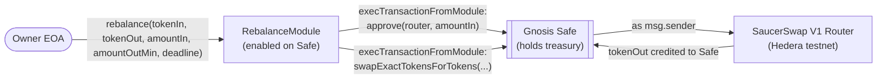
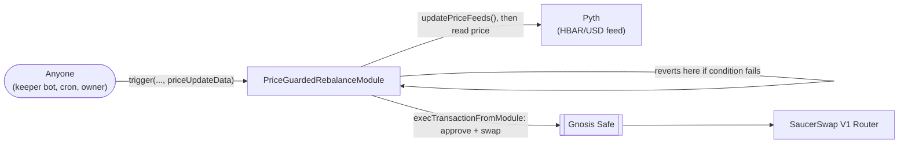

# hedera-safe-swap

A Gnosis Safe multisig treasury on Hedera, with two Safe modules that rebalance idle treasury
holdings through [SaucerSwap](https://www.saucerswap.finance/):

- **`RebalanceModule`** — an owner triggers a swap directly, any time.
- **`PriceGuardedRebalanceModule`** — permissionless to call, but only executes when a live
  [Pyth](https://pyth.network/) price condition holds. Anyone (a keeper bot, a cron job) can call
  `trigger()`; the price is the guard, not the caller.

Removing either integration removes the point of the module it's in: `RebalanceModule` without
SaucerSwap is a stock Safe deployment, and `PriceGuardedRebalanceModule` without Pyth has no
condition to gate on — it'd just be `RebalanceModule` again, badly.

## What's here

- `packages/contracts/contracts/RebalanceModule.sol` — owner-triggered swap through SaucerSwap.
- `packages/contracts/contracts/PriceGuardedRebalanceModule.sol` — permissionless swap, gated on
  a live Pyth price condition. Both are meant to be extended (see [AGENTS.md](AGENTS.md)).
- `packages/contracts/contracts/vendor/` — pulls the unmodified `@safe-global/safe-contracts`
  Safe singleton and `SafeProxyFactory` into the compile graph.
- `packages/contracts/contracts/mocks/` — test doubles (`MockSafe`, `MockERC20`,
  `MockSaucerSwapRouter`, and the Pyth SDK's own `MockPyth`) used only by the test suite, not
  deployed.
- `packages/contracts/scripts/deploy.ts` — the real deploy sequence for `RebalanceModule` (Phase 4).
- `packages/contracts/scripts/deploy-price-guard.ts` — deploys `PriceGuardedRebalanceModule`
  against an existing Safe and fires a real price-gated trigger.
- `packages/contracts/scripts/demo-rebalance.ts` — seeds the deployed Safe and triggers a real
  swap through `RebalanceModule` (Phase 7 — produced the transaction below).
- `packages/frontend` — Next.js app: wallet connect, a read-only Safe/treasury ledger, and a
  rebalance-trigger flow with live transaction status, all reading the real deployed contracts.

## Prerequisites

- Node 20.18.3+
- A funded Hedera testnet account (testnet HBAR from the [Hedera Portal faucet](https://portal.hedera.com/))
- A wallet extension that supports Hedera testnet (HashPack or Blade)

## Setup

```bash
npm install
cp .env.example .env
```

Then fill in `.env`:

| Variable                    | Where it comes from                                                                                                                                                                                                                 |
| --------------------------- | ----------------------------------------------------------------------------------------------------------------------------------------------------------------------------------------------------------------------------------- |
| `HEDERA_OPERATOR_ID`        | Your account ID (`0.0.x`) from the [Hedera Portal](https://portal.hedera.com/)                                                                                                                                                      |
| `HEDERA_OPERATOR_KEY`       | That account's **ECDSA** private key — not ED25519, which has no EVM alias. Fund the account with the Portal's testnet faucet before deploying.                                                                                     |
| `HEDERA_TESTNET_RPC_URL`    | Defaults to `https://testnet.hashio.io/api`, Hedera's public JSON-RPC relay                                                                                                                                                         |
| `SAUCERSWAP_ROUTER_ADDRESS` | The V1 router's EVM address. On testnet: `0x0000000000000000000000000000000000004b40` (contract `0.0.19264` — resolve the EVM form of any Hedera contract ID via `GET https://testnet.mirrornode.hedera.com/api/v1/contracts/{id}`) |
| `NEXT_PUBLIC_SAUCERSWAP_ROUTER_ADDRESS` | Same address as above, exposed to the browser — the frontend uses it for live swap quotes via `getAmountsOut` |
| `NEXT_PUBLIC_SAFE_ADDRESS`  | Printed by `deploy.ts` below — leave blank until you've deployed                                                                                                                                                                    |
| `NEXT_PUBLIC_MODULE_ADDRESS` | Also printed by `deploy.ts` — the `RebalanceModule` address |

## Deploy contracts to Hedera testnet

```bash
npm run build --workspace packages/contracts
npx hardhat run packages/contracts/scripts/deploy.ts --network hedera-testnet
```

This deploys the Safe singleton, `SafeProxyFactory`, one Safe proxy, and `RebalanceModule`, then
enables the module on the Safe. Copy the printed Safe address into `NEXT_PUBLIC_SAFE_ADDRESS`.

By default the Safe is deployed 1-of-1, owned by the deployer — enough to demo the module without
external wallet signing. For a real multi-owner Safe, set `SAFE_OWNERS` (comma-separated
addresses) and `SAFE_THRESHOLD` before deploying; `enableModule` then won't run automatically
(it needs a threshold of owner signatures collected out of band — see the script's console output
for what to submit).

## Run the frontend

```bash
npm run dev
```

Open http://localhost:3000. Connect any EIP-1193 wallet (MetaMask, HashPack, or Blade in EVM
mode — Hedera testnet is a standard EVM chain, so no HashConnect SDK is needed) and it prompts to
add/switch to Hedera testnet automatically. Once connected, the page reads the Safe's owners,
threshold, module status, and live treasury balances, and gives you two ways to move funds:

- **Rebalance** — owner-triggered, either direction (a toggle flips `tokenIn`/`tokenOut`), with a
  live SaucerSwap quote and a slippage % control that computes a real `amountOutMin`.
- **Price Guard** — shows `PriceGuardedRebalanceModule`'s configured trigger condition next to
  Pyth's live observed price, with a status dot for whether the condition currently holds. The
  "Fire trigger" button stays disabled until it does — no point letting someone submit a
  transaction that the contract will just revert.

Both share a step tracker (submitted → pending → mirror node → confirmed) and a direct Hashscan
link on success. The Price Guard section only renders if `NEXT_PUBLIC_PRICE_GUARD_MODULE_ADDRESS`
is set — it's optional.

## Architecture

**Components.** The Safe holds the treasury and is the only account SaucerSwap ever sees funds
move through. `RebalanceModule` is enabled on the Safe but never holds tokens itself — it only
has permission to make the Safe act.



**Why the module can't just hold funds itself:** the whole point is the Safe's multisig custody
stays intact — the module only ever acts _through_ `execTransactionFromModule`, so token balances
never leave Safe custody even mid-swap. Removing SaucerSwap from this picture removes the reason
the module exists; a Safe with no module is just a stock deployment, which is the gap this
template fills.

**Trigger flow in one call.** `rebalance()` does two things transactionally: it makes the Safe
`approve` the router for `amountIn`, then makes the Safe call `swapExactTokensForTokens`. Both
calls happen from `msg.sender == Safe`'s perspective, since `execTransactionFromModule` executes
_as_ the Safe, not as the module.

**The price-guarded path** is the same Safe-custody mechanism, with one thing in front of it:



`trigger()` is intentionally permissionless — the safety property isn't "only an owner can call
this," it's "this only ever executes when the price condition the owner configured actually
holds." The Safe owner still controls the condition itself via `setTrigger()`.

## Verified testnet transaction

Safe deployment (Phase 4) — module enabled on the Safe:

- Safe: [`0x487f330a30E6c7101f86e598BE27a5d46C8B3589`](https://hashscan.io/testnet/contract/0x487f330a30E6c7101f86e598BE27a5d46C8B3589)
- RebalanceModule: [`0x27714cc6907e8EB771CCe77159111b19Aa2E9Efe`](https://hashscan.io/testnet/contract/0x27714cc6907e8EB771CCe77159111b19Aa2E9Efe)
- `enableModule` tx: [`0x7054822d2f421fc441d9bfeec9d7bd4bda2c5aeb5a3e337bc200ad4bf8c45678`](https://hashscan.io/testnet/transaction/0x7054822d2f421fc441d9bfeec9d7bd4bda2c5aeb5a3e337bc200ad4bf8c45678)
- Mirror node: `GET https://testnet.mirrornode.hedera.com/api/v1/contracts/results/0x7054822d2f421fc441d9bfeec9d7bd4bda2c5aeb5a3e337bc200ad4bf8c45678` → `status: 0x1` (SUCCESS)

Rebalance (Phase 7) — a real swap executed through the module against SaucerSwap's live V1
router, converting the Safe's WHBAR into SAUCE:

- Rebalance tx: [`0x432d5e6bf726905b5e108d84f6e06df836473b8f80f3d061b777c93f039f322e`](https://hashscan.io/testnet/transaction/0x432d5e6bf726905b5e108d84f6e06df836473b8f80f3d061b777c93f039f322e)
- Mirror node: `GET https://testnet.mirrornode.hedera.com/api/v1/contracts/results/0x432d5e6bf726905b5e108d84f6e06df836473b8f80f3d061b777c93f039f322e` → `status: 0x1` (SUCCESS)
- Result: Safe swapped 2.5 WHBAR for 1.37386050 SAUCE via the SaucerSwap V1 HBAR-SAUCE pool
- Reproduce with `packages/contracts/scripts/demo-rebalance.ts` — see script header for what it does (HTS association, WHBAR wrap, funding the Safe, then triggering the module)

`PriceGuardedRebalanceModule` — deployed, enabled, and triggered for real against Pyth's live
Hedera testnet contract (`0xA2aa501b19aff244D90cc15a4Cf739D2725B5729`) and the HBAR/USD feed:

- PriceGuardedRebalanceModule: [`0x119B651AAab78687544D4Fb293cd8F245DDA9f04`](https://hashscan.io/testnet/contract/0x119B651AAab78687544D4Fb293cd8F245DDA9f04)
- Trigger tx: [`0x60c5c87372d1ba3f57248fe233fa775ea8540900c9d323e23d17b9fdca6a8358`](https://hashscan.io/testnet/transaction/0x60c5c87372d1ba3f57248fe233fa775ea8540900c9d323e23d17b9fdca6a8358)
- Mirror node: `GET https://testnet.mirrornode.hedera.com/api/v1/contracts/results/0x60c5c87372d1ba3f57248fe233fa775ea8540900c9d323e23d17b9fdca6a8358` → `status: 0x1` (SUCCESS)
- Condition: trigger configured for HBAR/USD ≤ $0.081. The module read a real on-chain price of
  **$0.08055012** from Pyth (decoded from the `Rebalanced` event: `observedPrice=8055012`,
  `observedExpo=-8`), confirmed the condition held, and swapped 7.76809070 WHBAR for 4.26781221
  SAUCE — all in one transaction.

**Known limitation, documented rather than hidden:** Pyth's Hermes API (the off-chain service that
serves fresh, signable price updates) started requiring an API key shortly before this was built.
Without one, `deploy-price-guard.ts` calls `trigger()` with an empty `priceUpdateData` array — a
real, supported Pyth code path (`getUpdateFee([])` costs `0`, `updatePriceFeeds([])` is a no-op) —
so the module reads whatever price is already stored on the testnet contract rather than pushing a
brand new one. That's still a genuine on-chain read, condition check, and swap against Pyth's real
contract; it's just not paired with a fresh off-chain push in this demo. A production deployment
should get a Hermes API key and push fresh updates on every trigger, with a tight
`maxPriceAgeSeconds` — not the generous one this script uses to tolerate a stale testnet feed.

## Reproducing the transaction

```bash
SAFE_ADDRESS=<from NEXT_PUBLIC_SAFE_ADDRESS> \
MODULE_ADDRESS=<RebalanceModule address, printed by deploy.ts> \
npx hardhat run packages/contracts/scripts/demo-rebalance.ts --network hedera-testnet
```

This script is what produced the transaction above. It, in order:

1. Associates the deployer's account with WHBAR and SAUCE (Hedera requires explicit HTS
   association before an account can hold a token — via each token's `IHRC719.associate()`).
2. Wraps 5 testnet HBAR into WHBAR through SaucerSwap's `WhbarHelper`.
3. Associates the **Safe** with both tokens too, via an owner-authorized `execTransaction` (the
   Safe is a separate account from the deployer, so it needs its own association).
4. Transfers half the wrapped WHBAR into the Safe.
5. Calls `RebalanceModule.rebalance()` as the Safe's owner, swapping that WHBAR for SAUCE through
   the real SaucerSwap V1 router — the transaction linked above.

The token pair, wrap amount, and split are constants near the top of the script — edit them
directly if you want to reproduce this against a different SaucerSwap pool.

## License

MIT
